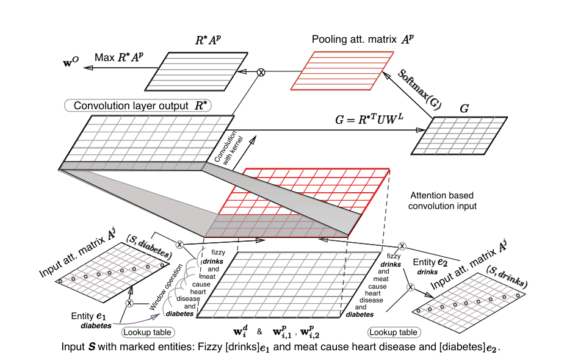

# Relation Classification via Multi-Level Attention CNNs

It's a implement of this paper：[Relation Classification via Multi-Level Attention CNNs](https://aclanthology.org/P16-1123.pdf).

## Training Step：

- use jupyter notebook to run the code in data/SemEval2010-Task8/DataFormat.ipynb to gengeate the formated dataset you need from the original dataset.

- run train_SemEval_multiAtt.py

## The function of each file:

- train_SemEval_multiAtt：in this file ,you need to define the paramter and define the encoder、model and framwork.
- multiAtt_encoder：it is a encoder,you need to encode the input to some intermediate results. it's extend the base_encoder,which is use to do some basic encode. And multiAtt_encoder contain the input attention and convolution.
- multiAtt_nn：it is a model. You can think of it as a decoder. In this file contain the pool-attention, and then you will get a output represention.
- multiAtt_re：it is a framework use to conbine the combine the encoer and model. you can get the output represention from the framework,then you need to compute the Similarity between of the output represention you get and the relation's represention.
- loss：it's a loss function that you need to define by yourself according to the paper.
- utils: some utils that you may need.
- dataloader: it's use to load the data and organize to the batch.
- word_tokenizer：it can used to split the sentence into some token.

## Result：

The result is not good. 

After 800 epoch, the accuracy only reach 62.45859%，and the macro f1 score is 0.569325。

I don't know why?

## Quote:

I refer to the following GitHub：

1. https://github.com/thunlp/OpenNRE
2. https://github.com/FrankWork/acnn
